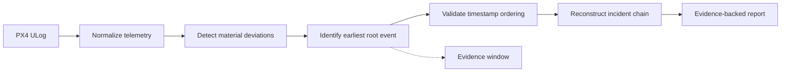

<div align="center">

# PAMIR

### Post-Mission Autonomous Incident Reconstruction

## **Tell me what failed first — and prove it.**

**Offline PX4 telemetry forensics · Root-event reconstruction · Timestamped evidence**

| **5 / 5** | **3 / 3** | **PASS** | **SHA256** |
|:---:|:---:|:---:|:---:|
| Public incidents | Healthy controls | Timestamp validation | Pinned inputs |

**v0.1 · VALIDATED BASELINE · LOCAL / OFFLINE**

</div>

---

PAMIR is an offline forensic analysis engine for autonomous-system telemetry. It reconstructs an incident timeline, identifies the **earliest material root event**, and preserves timestamped evidence showing what happened next.

> **Not just “what looks abnormal?” — PAMIR asks which defensible material event came first.**

## Forensic pipeline



## v0.1 — validated baseline

| Validation | Result |
| --- | ---: |
| Public PX4 incident ULogs | **5 / 5 material roots identified** |
| Healthy / control ULogs | **3 / 3 with no material root** |
| Timestamp causal validation | **PASS** |
| Benchmark inputs | **SHA256 pinned** |
| Operation | **Local / offline** |

Detailed measured results: [`benchmarks/VALIDATION.md`](benchmarks/VALIDATION.md)

## What PAMIR answers

1. **What failed first?** — earliest material root event.
2. **When did it happen?** — source telemetry timestamp.
3. **What happened next?** — strictly ordered incident evidence.
4. **What supports the conclusion?** — replayable evidence around each deviation.

```text
ROOT EVENT
└─ signal:      vehicle_rates_setpoint.pitch
   confidence:  0.999
   evidence:    [t-0.50s ... t+0.75s]

   ├─ likely_caused ─► attitude deviation
   └─ followed_by   ─► motion deviation
```

`confidence` is an uncalibrated anomaly-strength heuristic, not a probability of causation. `likely_caused` is a conservative evidence-ordering relationship based on timestamp order, temporal proximity, and signal-family transitions.

## Quick start

```bash
python -m venv .venv
source .venv/bin/activate  # Windows: .venv\Scripts\activate
pip install -e .[dev]
pytest -q
pamir analyze path/to/flight.ulg -o pamir-report.json
```

## Reproduce the public benchmark

```bash
python scripts/download_px4_benchmarks.py
python scripts/validate_px4_benchmarks.py
```

The hard v0.1 corpus contains five directly accessible public incident ULogs and three healthy/control ULogs. Required cases and SHA-256 digests are pinned in [`benchmarks/px4_reproducible_incidents.json`](benchmarks/px4_reproducible_incidents.json).

## v0.1 forensic method

PAMIR evaluates eligible signals against recent telemetry history using a rolling robust median/MAD baseline. Root selection is intentionally conservative and evidence windows preserve the reported observations around each material deviation.

The system enforces:

- reproducible public inputs;
- strict timestamp ordering;
- bounded finite confidence values;
- evidence windows containing reported observations;
- required downstream telemetry after incident roots;
- no material root on the healthy/control corpus.

## Validation status — 2026-09-12

**PAMIR v0.1 REPRODUCIBLE VALIDATION GATE PASSED**

```text
v0_1_complete: true
validation_passed: true
validation_errors: []
required_incident_count: 5
required_control_count: 3
```

PR #2 was merged to `main` after the benchmark and regression gates passed.

## Current direction

v0.1 is frozen as a validated baseline. The immediate priority is **external validation** against additional public ULogs and real-world telemetry, together with methodology review and evidence-backed incident cases.

Technical criticism and additional public PX4 ULogs are welcome.

## Scope boundary

PAMIR is focused on reliability, telemetry analysis, test/measurement, incident reconstruction, and mission assurance.
